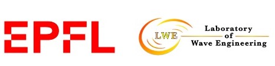
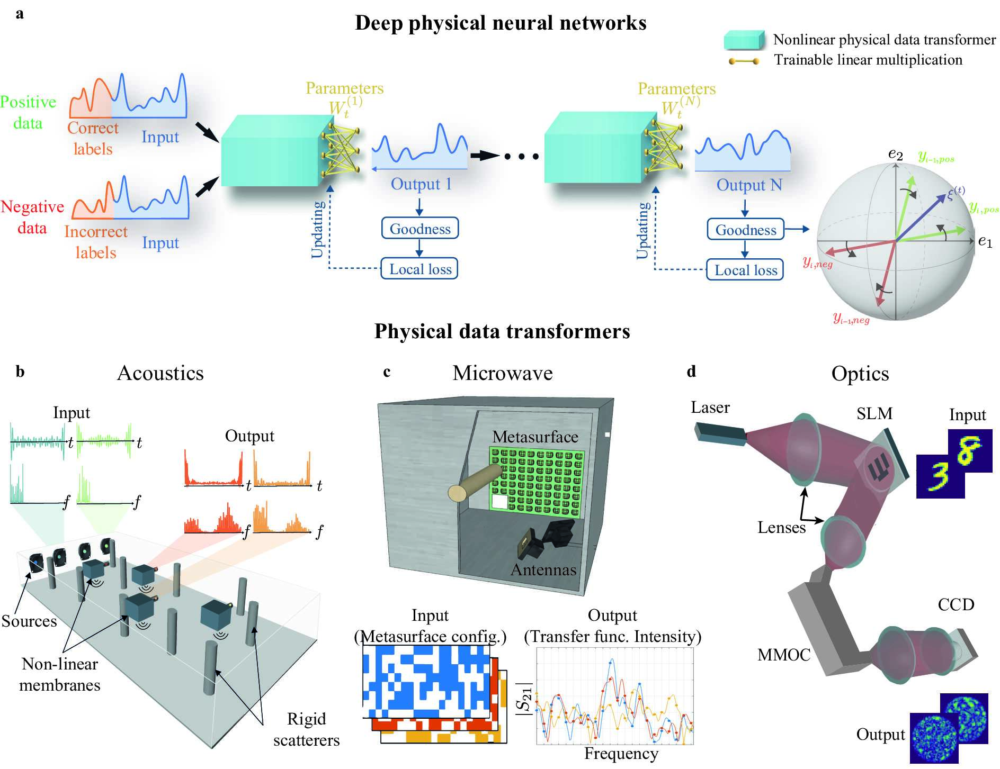

PhyLL: Backpropagation-free Training of Deep Physical Neural Networks
=================
[](#python)
[](https://arxiv.org/abs/2304.11042)
[](https://opensource.org/licenses/MIT) 
[](https://github.com/psf/black) 


<p align="center">
  
</p>


In this work, we proposed a simple deep neural network architecture augmented by a physical local learning (PhyLL) algorithm, enabling supervised and unsupervised training of deep physical neural networks without detailed knowledge of the nonlinear physical layer’s properties. We trained diverse wave-based physical neural networks in vowel and image classification experiments, showcasing our approach’s universality. Our method shows advantages over other hardware-aware training schemes by improving training speed, enhancing robustness, and reducing power consumption through eliminating the need for system modeling and thus decreasing digital computation.

<p align="center">
  
</p>


<a name="citation"/>  

Citation
-------------

<a name="citations"/>  

If you use this code for your research, please cite the following work:
```
@article{momeni2023backpropagation,
  title={Backpropagation-free Training of Deep Physical Neural Networks},
  author={Momeni, Ali and Rahmani, Babak and Mallejac, Matthieu and Del Hougne, Philipp and Fleury, Romain},
  journal={arXiv preprint arXiv:2304.11042},
  year={2023}
}
```
Have a question not listed here? 
send us an [email](ali.momeni@epfl.ch).
